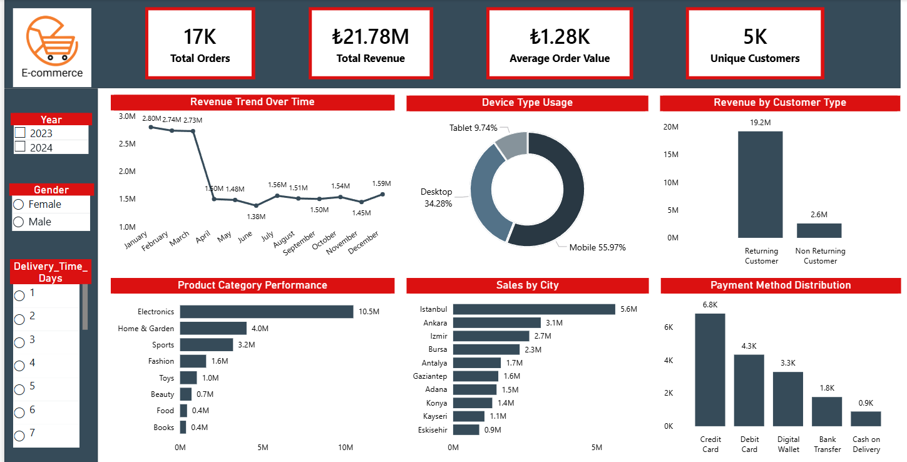

# E-Commerce Customer Behavior Analysis

## Project Overview

This project analyzes customer purchasing behavior and sales performance for an e-commerce platform using SQL and data visualization.

The objective is to extract meaningful insights from transactional data to understand:

* Revenue trends
* Customer behavior
* Product performance
* Customer experience
* Device usage patterns

The analysis is performed using SQL queries and visualized using an interactive Power BI dashboard.

---

## Tools Used

* SQL for data analysis
* Microsoft Power BI for dashboard visualization
* GitHub for project hosting

---

## Dataset Description

The dataset contains customer transactions and behavioral information with fields such as:

* Order_ID
* Customer_ID
* Date
* Age
* Gender
* City
* Product_Category
* Unit_Price
* Quantity
* Discount_Amount
* Total_Amount
* Payment_Method
* Device_Type
* Session_Duration_Minutes
* Pages_Viewed
* Is_Returning_Customer
* Delivery_Time_Days
* Customer_Rating

---

## Key Business Questions

The project explores the following analytical questions:

* What are the overall revenue trends over time?
* Which cities generate the highest sales?
* Which product categories perform best?
* What devices are most commonly used by customers?
* Do returning customers contribute more revenue than new customers?
* Which payment methods are most frequently used?

---

## Dashboard

Below is the Power BI dashboard built to visualize the analysis.

The dashboard includes:

* KPI metrics such as total revenue, total orders, average order value, and unique customers
* Revenue trend over time
* Device usage distribution
* Revenue comparison between returning and new customers
* Product category performance
* Sales distribution by city
* Payment method usage

---

## Key Insights

### Revenue Performance

* The platform generated over **₹21M in total revenue** from approximately **17K orders**.
* Average order value is approximately **₹1.28K**, indicating moderate purchase size per transaction.

### Customer Behavior

* **Returning customers generate significantly more revenue** compared to new customers.
* This indicates strong customer retention and repeat purchasing behavior.

### Device Usage

* **Mobile devices account for the majority of purchases**, highlighting the importance of mobile optimization for e-commerce platforms.

### Product Performance

* The **Electronics category contributes the highest revenue**, significantly outperforming other categories.
* Categories such as Beauty, Books, and Food show lower revenue contribution.

### Regional Sales

* Sales are concentrated in a few major cities, with **Istanbul generating the highest revenue**.

### Payment Preferences

* **Credit cards are the most commonly used payment method**, followed by debit cards and digital wallets.

---

## Business Recommendations

Based on the analysis:

* Optimize the mobile shopping experience since most purchases occur via mobile devices.
* Focus marketing campaigns on high-performing product categories such as electronics.
* Develop loyalty programs to further encourage repeat purchases from returning customers.
* Improve delivery logistics in regions with longer delivery times to enhance customer satisfaction.

---

## Project Structure

Raw dataset used for analysis
sql/ → SQL queries used to perform data analysis
dashboard/ → Power BI dashboard and screenshot

---

## Future Improvements

Future enhancements could include:

* Customer segmentation analysis
* Predictive analytics for sales forecasting
* Cohort analysis for customer retention

---

## Author

Created by **Esha Bansal** as a part of the Data Analytics Portfolio.

Data Analyst Portfolio Project
